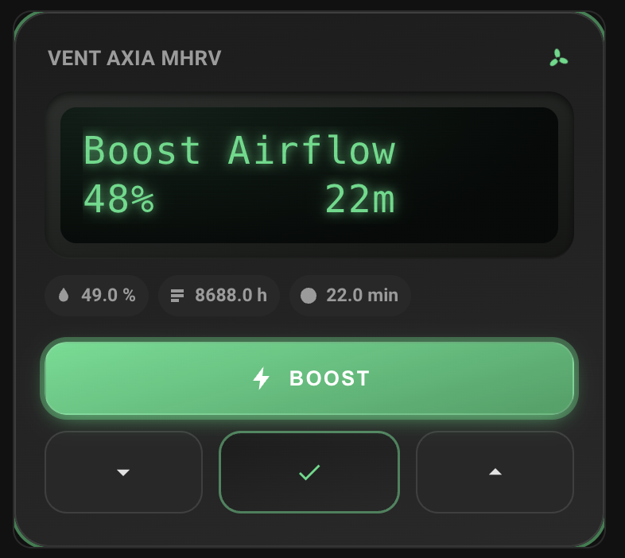

# esphome-vent-axia

An ESPHome component for the Vent-Axia Sentinel Kinetic MVHR, driven through its
wired-remote serial port.

The component impersonates the wired remote. It decodes the unit's display into
typed Home Assistant entities and drives the keypad to read and write the unit's
settings, so the YAML config is a list of entities rather than a program.

Developed against a **Sentinel Kinetic B, firmware V32/05**.

## Status

Under construction. See `PLAN.md` for the design and the staged rollout.

## Features

- **Live status decode** — airflow, fan RPM and drive percentage, supply/extract
  air temperatures, indoor temperature and humidity (plus a 5-minute average),
  filter hours remaining, and the raw display lines, all as typed sensors
  instead of scraped strings.
- **State flags as binary sensors** — summer bypass, boost, purge, defrost,
  dryout, filter-change-due and MVHR link status, plus a `busy` sensor so a
  slow keypad-driven operation (up to ~30s) is visible on a dashboard instead
  of looking hung.
- **Diagnostic page scrape** — a scheduled sequence walks the unit's
  diagnostic pages and exposes frost protection state/mode, sensor and
  24V-rail fault flags, wireless-receiver and wall-switch status, serial
  number and firmware version.
- **Settings read/write** — summer bypass on/off and its indoor/outdoor
  temperature targets, read back from the unit (not held optimistically) and
  writable through Home Assistant numbers and switches.
- **Clock sync** — a weekly scheduled job keeps the unit's clock correct; it
  has no daylight-saving awareness and drifts after ~2 weeks without mains
  power.
- **Boost and purge as a set-point** — an `airflow_mode` select (Normal /
  Boost 30 min / Boost 60 min / Boost Continuous / Purge) rather than key
  presses, since the unit's Main key is a cumulative counter.
  **Continuous boost is reported and commandable.** It shows no countdown on
  the display, so it is decoded as "boosting, not purging, and no countdown
  seen at any point in this boost episode" — held for longer than the status
  line's own alternation timeout before being believed, so that a timed boost
  expiring (countdown gone, boost flag not yet aged out) is never mistaken for
  it. That confirmation costs ~20s, so a continuous boost takes about that
  long to appear.
- **A switch-driven `Boost Continuous` cannot be cancelled from Home
  Assistant** — established on hardware, not merely suspected. A wired wall
  switch (commonly a *switched live* taken off a bathroom or toilet light, so
  it stays asserted for as long as the light is on) holds the unit's own boost
  input directly. The unit goes on cycling its status loop and accepting key
  presses, but the boost does not move: its tap counter is not what is holding
  it. Nothing but the switch releasing will clear it.

  Selecting `Normal` during one therefore fails, on purpose and quickly.
  `SetAirflowMode` watches the display across its normalising taps and, after
  two consecutive Main taps that move neither the airflow percentage nor the
  countdown, gives up and logs that the boost appears held on by an external
  switched live. That takes a few seconds rather than the full four-tap guard,
  and it names the cause instead of reporting that it does not know.

  A `Switched Live Boost Input` binary sensor reads this from diagnostic
  page 05, which is the only page that reports it — the `Wall Switch SW1-3`
  sensors read **OFF** right through a switch-initiated boost, asserted or
  not, so they are not a corroborating signal for anything here. Note that
  page 05 arrives on the ~15-minute diagnostics scrape and is stale by
  construction: treat it as an explanation after the fact, not a live
  interlock. The status line remains the live evidence.
- **Raw keypad escape hatch** — Up/Down/Set/Main exposed as bounded-duration
  buttons (never hold-switches, which could stick a key down forever across a
  reboot) for cases the decoded entities don't cover.
- **Structural mutual exclusion** — a single sequence engine (`Runner`) pumps
  one command sequence at a time, so overlapping operations are refused and
  logged rather than racing on the wire.
- **Chip-agnostic** — no hardware timer ISR, no chip-family `#ifdef`. CI
  compiles ESP8266, ESP32 (Arduino) and ESP32 (IDF) examples.
- **Host-testable core** — the protocol framing, display/status decode,
  diagnostic table and sequence state machines compile and run outside
  ESPHome, so most of the logic is covered by a fast, hardware-free test
  suite (`tests/`).

## Design notes

### Portable core

`protocol`, `screens`, `display`, `parser`, `status`, `diagnostics` and
`sequence` include **no ESPHome headers**. They are plain C++ compiled both
into the firmware and into the host test suite in `tests/`, which is what
makes the protocol, the status-line decode and the menu-driving state
machines testable without hardware. Only `vent_axia.cpp` and the platform
files (`sensor.py` and friends) touch `esphome/components/...`.

If a core file stops compiling on the host, it has grown an ESPHome dependency
and the dependency belongs on the other side of that line.

### Chip agnostic

There is no chip-family `#ifdef` anywhere, and no interrupt handler. Held keys
are retransmitted from `loop()` on a `millis()` comparison, which is the single
decision that keeps the component portable: the previous implementation needed
two incompatible hardware-timer backends, and its ESP32 one used an
Arduino-ESP32 2.x API that 3.x removed.

CI compiles `example/esp8266.yaml`, `example/esp32-arduino.yaml` and
`example/esp32-idf.yaml`, so a platform-specific regression fails the build.

Only the ESP8266 build is validated against real hardware, because that is the
only dongle in hand. ESP32 support means "compiles, and has no known platform
dependency" -- not "tested on a unit".

## Hardware

- **Board**: alextrical's wired-remote-replacement dongle
  ([hardware repo](https://github.com/alextrical/ESP32-Sentinel-Kinetic-Wireless-Dongle)),
  early revision, ESP8266EX.
- **Link**: the MVHR's 2-wire wired-remote port (RJ9/4P4C) at 9600 8N1. These
  are true RS232 levels (+/-9 V), not TTL -- the dongle's MAX3232 is doing
  necessary work.
- **Not** the separate BMS/MODBUS socket, which is untested.

## Home Assistant card

`lovelace-card/sentinel-remote-card.js` is a custom Lovelace card that
reinterprets the physical wired remote (16x2 display, Boost/Down/Select/Up)
as a dashboard panel.



### Installation

1. Download `lovelace-card/sentinel-remote-card.js` and copy it into
   `<config>/www/sentinel-remote-card.js` (create the `www` folder in your
   Home Assistant config directory if it doesn't exist yet — you can use the
   Studio Code Server / File Editor add-on, or Samba/SSH).
2. In Home Assistant: **Settings -> Dashboards -> ⋮ (top right) -> Resources
   -> Add Resource**.
   - URL: `/local/sentinel-remote-card.js`
   - Resource type: `JavaScript Module`
3. Reload the dashboard (or do a hard browser refresh).
4. Add a new card, choose **Manual** / **Edit in YAML**, and paste in a
   config like the one below.

For your "Vent-Axia MHRV" ESPHome device specifically, this is ready to
paste as-is (entity IDs pulled from your live device page):

```yaml
type: custom:sentinel-remote-card
title: Hallway MVHR
line1_entity: sensor.house_vent_axia_mhrv_display_line_1_top
line2_entity: sensor.house_vent_axia_mhrv_display_line_2_bottom
boost_button: button.house_vent_axia_mhrv_key_main
down_button: button.house_vent_axia_mhrv_key_down
select_button: button.house_vent_axia_mhrv_key_set
up_button: button.house_vent_axia_mhrv_key_up
humidity_entity: sensor.house_vent_axia_mhrv_indoor_humidity_in_extract_air
filter_entity: sensor.house_vent_axia_mhrv_filter_hours_remaining
boost_remaining_entity: sensor.house_vent_axia_mhrv_boost_time_remaining
boost_active_entity: binary_sensor.house_vent_axia_mhrv_boost_active
running_entity: binary_sensor.house_vent_axia_mhrv_boost_active
```

## Running the tests

```sh
cd tests
cmake -B build -S . && cmake --build build && ./build/run_tests
```

No dependencies beyond a C++17 compiler and CMake.

## Acknowledgements

This project would not exist without the reverse-engineering and hardware
work of others:

- **[aelias-eu/vent-axia-remote](https://github.com/aelias-eu/vent-axia-remote)**
  — the original reverse-engineering of the Sentinel Kinetic's wired-remote
  serial protocol. The framing and command decode here builds directly on
  that work.
- **[alextrical](https://github.com/alextrical/ESPHome-Vent-Axia-Sentinel-Kinetic)** — the original ESPHome
  component for this device, and the
  [ESP32-Sentinel-Kinetic-Wireless-Dongle](https://github.com/alextrical/ESP32-Sentinel-Kinetic-Wireless-Dongle)
  hardware this component runs on.

This is an independent rewrite: same protocol and hardware target, different
architecture (see "Design notes" above) and license.

## Licence

GPL-3.0 -- see `LICENSE`.
